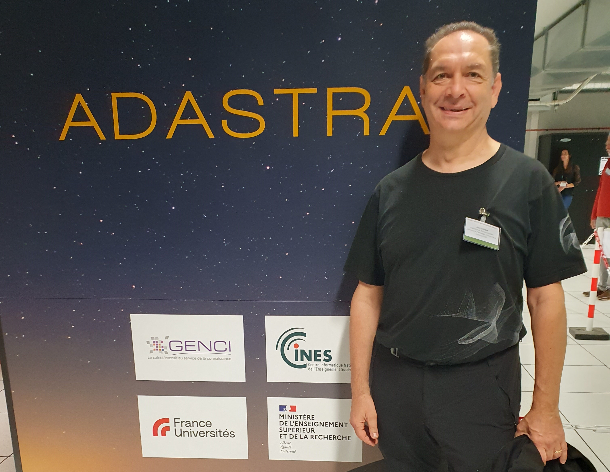

Version longue du début de l'entretien avec `Juan Escobar <mailto:juan.escobar-munoz@cnrs.fr>`_ (LAERO, CNRS)
******************************************************************************************************************

Juan, tu as porté Méso-NH 5-5-1 sur GPU avec Philippe. Pourrais-tu décrire de quoi il s'agit et les perspectives d'utilisation que cela ouvre ?
  Les cartes graphiques (GPU pour *Graphics Processing Unit*), par leur architecture, leur puissance de calcul et leur bande passante mémoire sont en fait les dignes successeurs des anciens supercalculateurs parallèles et vectoriels de la famille CRAY ou NEC FUJITSU, que l'on utilisait dans les années 2000 pour faire tourner Méso-NH sur les centres de calcul nationaux de l'IDRIS ou Météo-France. On retrouve à l'intérieur d'une de ces cartes, plusieurs dizaines de 'processeurs' indépendants que l'on peut utiliser en parallèle et ces processeurs sont capables eux-mêmes d’exécuter plusieurs milliers d'instructions 'vectorielles' identiques, et ce avec des vitesses d'accès à la mémoire d'un ordre de grandeur supérieur à celles des CPU (processeurs de nos PC). La différence est que au lieu de coûter plusieurs millions d'euros ceux-ci n'en coûtent que quelques milliers, et de plus ceux-ci ne consomment que quelques centaines de kilowatts au lieu de milliers voire millions de watts pour faire les mêmes calculs que les super-calculateurs. 

  C'est pourquoi dès les années 2010, avec les premiers compilateurs Fortran développés à l'époque par PGI (*Portland Group Incorport*) permettant d'utiliser ces GPU pour faire du calcul (technologie appelée GPGPU pour *General-Purpose computing on Graphics Processing Units*), j'ai commencé à essayer de porter MesoNH sur ces GPUs. A l'époque, en pionnier, PGI avait développé son propre langage de programmation par directives, ACC, qui consiste en l'ajout de commentaires dans le code pour indiquer au compilateur quelles parties du code exécuter sur GPU. Au cours des années, le langage a été normalisé pour devenir le standard de programmation OpenACC, supporté par plusieurs constructeurs dont NVIDIA et AMD (fondeur de cartes graphiques) et HPE/CRAY (assembleur de supercalculateurs).

  Actuellement les parties les plus coûteuses en temps de calcul, environ 90% de ce temps, ont été portées sur GPU (advection, turbulence, microphysique à un moment et solveur de pression) ce qui permet de faire des simulations scientifiques avec cette version, MNH-V55-OpenACC, portée même partiellement sur GPU. C'est ce qui a été fait pendant le Grand Défi Adastra GPU, sur le Centre de Calcul du CINES a Montpellier où différents événements extrêmes (tempête Alex, Derecho en Corse, Orage en Amazonie), ont été simulés en utilisant jusqu'à 128 nœuds de calcul, soit 1024 GPUs : environ 1/3 de la partition GPU de Adastra.

Quel intérêt y a-t-il à réaliser des simulations sur les calculateurs dotés de GPU plutôt que sur ceux basés sur des CPU uniquement ?
  L'intérêt vient premièrement de la puissance de calcul disponible avec les nœuds dotés de GPU par rapport à ceux uniquement équipés de CPU. Ainsi, sur Adastra, la partition GPU ne comprend que 338 nœuds, mais est créditée d'une puissance théorique de 61 Pétaflops (61 millions de milliards d'opérations de calcul par seconde) alors que la partition de 556 nœuds équipée des tous derniers CPU ne délivre elle que 13 Pétaflops. Le deuxième intérêt vient de la 'sobriété' énergétique des GPU par rapport aux CPU pour délivrer une puissance de calcul équivalente. Pour le Grand Challenge Adastra, les tests de performance ont montré qu'en utilisant 128 nœuds (soit GPU, soit CPU), le code tournant sur GPU va environ 5 fois plus vite que sur CPU, tout cela en consommant environ 2 fois moins d'énergie.

  Il faut noter aussi que cet écart entre la puissance de calcul délivrée par les GPU versus celle délivrée par les CPU va aller en s'accroissant. Ainsi, sur le premier SuperCaculateur Européen devant atteindre 1 Exaflops, en cours d'installation dans le centre de calcul de Jülich en Allemagne, la partition GPU délivrera 1 Exaflops, soit 1000 Pétaflops alors que la partition CPU elle ne délivrera que 50 Pétaflops, soit 0.5% de la puissance de calcul total !!!

Y a-t-il des situations qui se prêtent particulièrement bien à l'utilisation de Méso-NH 5-5-1 sur GPU ?
  Comme je l'ai indiqué, les GPU sont essentiellement des mini-super-calculateurs parallèles et vectoriels. Pour tirer parti de leur performance, il faut donc les alimenter avec beaucoup des données et de calculs pouvant être traités en parallèle de façon indépendante. C'est typiquement le cas des simulations dites Giga-LES, où les tailles de grilles sont de l'ordre du milliard de points (Giga- pour milliard). Pour le Grand Challenge Adastra GPU, les grilles allaient jusqu'à 4096x4096x128 points (pour 100 mètres de résolution), soit 2,14 milliards de points.

  On peut aussi bien sûr utiliser des configurations plus petites, mais profiter de la puissance de calcul accrue des GPU pour en faire beaucoup d'un seul coup. Par exemple, on a créé sur Adastra GPU une base de données de simulations sur la Corse avec environ 350 jours simulés. Dans ce cas, pour ce premier test, à 1 km de résolution, la grille ne fait que 256x256x70 points, que l'on a fait tourner sur 1 seul nœud GPU, avec 16 tâches MPI, soit des sous-domaines de 64x64x70 points par GPU (taille de sous-domaine minimum pour garder une bonne efficacité de parallélisation sur GPU). Comme 1 seul nœud par journée simulée est nécessaire, on a pu lancer des centaines de jobs en simultané sur des nœuds GPU différents et réaliser l'ensemble des 350 jours de simulation en 3 jours 'humains'.
