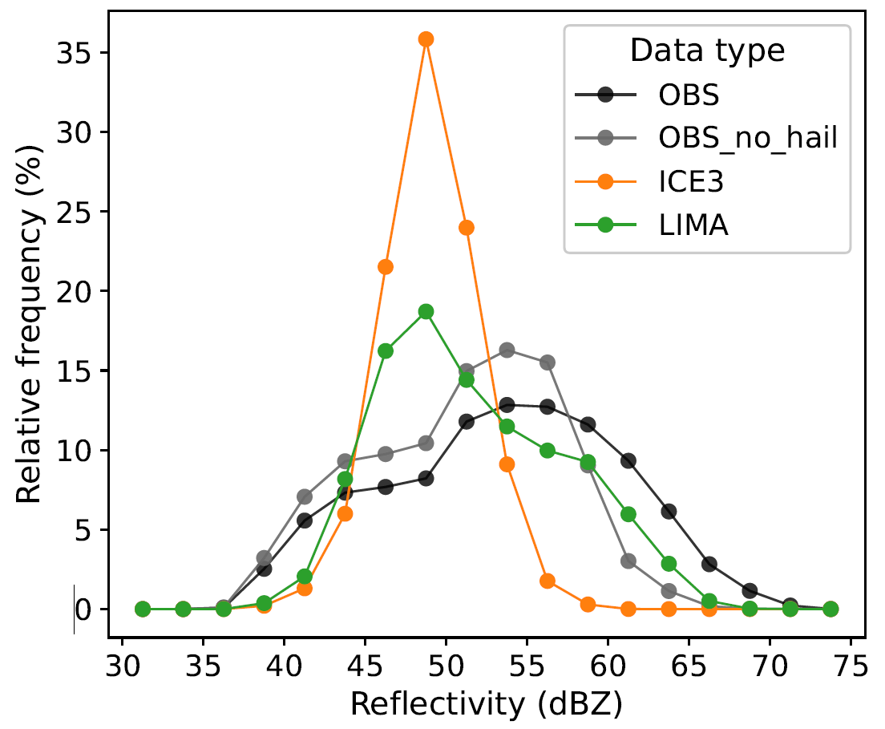

Infolettre #07
================================================

**10 octobre 2025.** Version française, English version `here <newsletter_07_english.html>`_.

Chers utilisateurs, chères utilisatrices de Méso-NH,

Voici ci-dessous la 7ème infolettre de notre communauté. Vous y trouverez un entretien avec la développeuse d'un outil utile aux utilisateurs et utilisatrices de Méso-NH, les dernières nouvelles de l’équipe support et la liste des dernières publications utilisant Méso-NH.

Entretien avec `Clotilde Augros <mailto:clotilde.augros@meteo.fr>`_ (CNRM)
************************************************************************************

Clotilde, tu as développé un simulateur radar qui peut tourner à partir des sorties de Méso-NH. Pourrais-tu résumer ce que fait cet outil ?
  Ce code, appelé **operadar** (Observation oPErator for polarimetric RADAR, `Augros et al., 2016 <https://doi.org/10.1002/qj.2572>`_, `David et al. 2025 <https://doi.org/10.5194/amt-18-3715-2025>`_) prend les variables du modèle en entrée (rapports de mélange et éventuellement concentrations en nombre des hydrométéores, température, altitude, pression) et calcule en chaque point de grille du modèle les variables radar (réflectivité :math:`Z_H`, réflectivité différentielle :math:`Z_{DR}`, phase différentielle spécifique :math:`K_{DP}`, coefficient de corrélation :math:`\rho _{HV}`) à partir de tables de coefficients de rétrodiffusion. La méthode de diffusion utilisée est la méthode de la matrice T (`Waterman, 1965 <https://doi.org/10.1109/PROC.1965.4058>`_) qui représente les hydrométéores comme des sphéroïdes aplatis, mais on peut aussi choisir de calculer les variables radar avec l’approximation de Rayleigh. 

  Le code est constitué de deux étapes principales : la première permet de générer les tables de coefficients de rétrodiffusion pour chaque bande de fréquence, chaque type d’hydrométéore, et chaque schéma microphysique. Elle s’appuie en partie sur le code fortran77 de `Mishchenko et Travis (1994) <http://www.sciencedirect.com/science/article/pii/0030401894907315>`_. Une deuxième étape, codée en python, permet la lecture des champs simulés, des tables de coefficients, et le calcul des variables radar. 

  L’ensemble du code **operadar** est conçu pour fonctionner *hors ligne*. Il est indépendant du code Méso-NH, et peut aussi bien être utilisé avec des sorties AROME par exemple. Les améliorations apportées lors de l'application à l’un de ces deux modèles bénéficient à tous grâce au maintien et à l'évolution collaborative du code sur le `dépôt git d'operadar <https://github.com/UMR-CNRM/operadar>`_.

Pourquoi vaut-il mieux utiliser cet outil que les autres simulateurs radar inclus dans les diagnostics de Méso-NH ?
  Il existe effectivement trois versions *en ligne* de simulateur radar dans Méso-NH implémentées dans la partie DIAG [#oponline]_, une qui n'utilise que l'approximation de Rayleigh pour le calcul de la diffusion, une autre prenant en compte l'aplatissement des hydrométéores mais non-maintenue depuis 2018, et une troisième adaptée à la bande W uniquement pour les radars nuage aéroportés ou sol, qui ne tient pas compte de l’aplatissement des hydrométéores. Des options plus avancées sont maintenant disponibles avec **operadar** : la prise en compte de l’oscillation des hydrométéores en plus de leur aplatissement, différents choix de formulation des constantes diélectriques, et une version plus avancée de la représentation de la fonte et de la phase mixte. Ces améliorations ont par exemple permis de simuler avec succès les colonnes de :math:`Z_{DR}` associées à la présence de grosses gouttes d’eau surfondue au sein des courants ascendants des orages (`Kumjian et al., 2014 <https://doi.org/10.1175/JAMC-D-13-0354.1>`_) avec AROME et le schéma LIMA (`David et al., 2025 <https://doi.org/10.5194/amt-18-3715-2025>`_).

  En 2025, dans le cadre de la thèse de Cloé David, de nouvelles options ont été ajoutées également pour permettre la cohérence avec des options microphysiques récemment disponibles dans AROME et Méso-NH, comme la nouvelle fonction de distribution en taille pour la neige (PSD de `Wurtz et al., 2023 <https://doi.org/10.1002/qj.4437>`_). Le code permet aussi de spécifier pour chaque espèce indépendamment le nombre de moments (1 ou 2) afin de pouvoir s’adapter à différentes configurations de LIMA (2 moments pour l’eau liquide, 2 moments pour l’eau liquide et les cristaux, ou entièrement 2 moments).

  Les comparaisons entre simulations et observations montrent une très bonne représentation des variables :math:`Z_H`, :math:`Z_{DR}` et :math:`K_{DP}` dans la pluie avec le schéma microphysique LIMA (`David et al., 2025 <https://doi.org/10.5194/10.5194/amt-18-3715-2025>`_) sur plus de 34 cas d’orage simulés avec AROME, meilleure qu'avec le schéma microphysique ICE3 qui sous-estime les réflectivités maximales (Figure 1).

  Extrait de `David et al. (2025) <https://doi.org/10.5194/amt-18-3715-2025>`_ (Figure 5): Fréquence relative des valeurs maximales de réflectivité radar (maximum sur la verticale) au sein des cœurs convectifs des orages, définis par un seuil de réflectivité > 40 dBZ, pour 34 cas d’orages sévères observés par radar sur la France métropolitaine. Courbe grise : toutes les observations qui ne sont pas associées à de la grêle (telle que détectée par radar), courbe noire : toutes les observations. Courbe orange : simulations AROME avec ICE3, courbe verte : simulations AROME avec LIMA.

Dans quel cas recommandes-tu l'utilisation de ce module ?
  Je recommande l’utilisation d’**operadar** pour l'évaluation de la représentation des nuages et des précipitations dans des simulations Méso-NH (ou AROME). Ce code est nécessaire dès qu’on s’intéresse à des cas de pluie forte pour des longueurs d'onde radar correspondant à la bande C (~ 5 cm) et inférieures, ainsi que pour tout type de précipitation avec toutes les bandes de fréquence, si on souhaite prendre en compte l’aplatissement des hydrométéores (S ~ 10 cm, C ~ 5 cm, X ~ 3 cm, Ku ~ 2 cm, K ~ 1.5 cm, Ka ~ 1 cm, W ~ 0.3 cm).

Quelles recommandations ferais-tu aux utilisateurs.rices ? 
  Le code est en constante évolution, en particulier dans le cadre de la thèse de Cloé David. Les travaux d’amélioration se poursuivent en 2025  avec un focus particulier sur les espèces glacées (revisite des choix de rapport d’axe, d’oscillation, lois densité-diamètre, PSD). Il vaut mieux `me contacter <mailto:clotilde.augros@meteo.fr>`_ pour tout souhait d’utilisation, afin qu’on détermine ensemble les options les plus pertinentes, parmi celles disponibles au moment de l’étude.

Quelles sont les limites ? Dans quel cas cette option est-elle plutôt à éviter ?
  Pour l'instant il y a deux limitations principales. D'une part, la simulation de la géométrie du radar n'est pas encore intégrée à ce code mais le sera prochainement. D'autre part, pour les bandes de fréquence K, Ka, Ku et W, la pertinence des simulations avec la méthode T-matrice reste à confirmer pour la neige.  D'autres méthodes plus complexes (Discrete Dipole Approximation DDA, Self Similar Rayleigh Gans Approximation SSRGA) sont utilisées dans la littérature. A ce titre, une comparaison avec le simulateur radar de RTTOV-SCAT qui utilise des tables produites avec la méthode DDA est envisagée en 2026.

.. [#oponline] Il existe effectivement aussi trois versions “online” du simulateur radar dans Méso-NH, implémentées dans la partie DIAG :
   **(1)** la première version de simulateur radar de Méso-NH (NVERSION_RAD=1, `Richard et al., 2003 <https://doi.org/10.1256/qj.02.50>`_) permet de calculer les variables radar dans la géométrie du modèle (grille 3D), en appliquant l’approximation de Rayleigh pour le calcul de la diffusion, qui reste valide tant que la taille des hydrométéores est très petite devant la taille de la longueur d’onde :math:`\lambda`. Pour des radars en bande S (:math:`\lambda` ~ 10 cm), cette hypothèse est valide pour tous les hydrométéores sauf la grêle. Pour des radars en bande C (:math:`\lambda` ~ 5 cm), on sort du cadre de cette hypothèse si on simule des pluies intenses avec de grosses gouttes d’eau (~ 8 mm).
   **(2)** une deuxième version (NVERSION_RAD=2, Caumont et al., 2006, `Augros et al., 2016 <https://doi.org/10.1002/qj.2572>`_) a été implémentée dans Méso-NH en fortran pour inclure différentes méthodes de diffusion, dont la diffusion de la matrice T (`Waterman, 1965 <https://doi.org/10.1109/PROC.1965.4058>`_) qui permet de simuler la diffusion pour des hydrométéores aplatis y compris lorsqu’on sort du régime de Rayleigh (soit pour la pluie intense dès la bande C, ou pour la grêle, ou pour des bandes de fréquence plus faibles: K, Ka, Ku, W). Cependant, cette deuxième version n’a pas été maintenue depuis 2018.
   **(3)** une troisième version a été implémentée dans la routine aircraft_balloon_evol. La bande de fréquence est fixée à celle du radar nuage Rasta: bande W (:math:`\lambda` = 3.15 :math:`10^{-3}` m, fréquence = 95.04 GHz). Cette version utilise la diffusion de Mie, donc les hydrométéores sont considérés comme des sphères. Elle prend en compte l’atténuation par les hydrométéores le long du faisceau. La bande brillante est simulée via l’ajout d’une fraction liquide à l’espèce graupel, comme proposé dans Augros et al. (2016).

Références
  - Comparisons between S, C, and X band polarimetric radar observations and convective-scale simulations of HyMeX first special observing period [`Augros et al., 2016 <https://doi.org/10.1002/qj.2572>`_]
  - Improved Simulation of Thunderstorm Characteristics and Polarimetric Signatures with LIMA 2-Moment Microphysics in AROME [`David et al., 2025 <https://doi.org/10.5194/amt-18-3715-2025>`_]
  - The Anatomy and Physics of ZDR Columns: Investigating a Polarimetric Radar Signature with a Spectral Bin Microphysical Model [`Kumjian et al., 2014 <https://doi.org/10.1175/jamc-d-13-0354.1>`_]
  - T-matrix computations of light scattering by large spheroidal particles [`Mishchenko and Travis, 1994 <http://www.sciencedirect.com/science/article/pii/0030401894907315>`_]
  - High-resolution numerical simulations of the convective system observed in the Lago Maggiore area on 17 September 1999 (MAP IOP 2a) [`Richard et al., 2003 <https://doi.org/10.1256/qj.02.50>`_]
  - Matrix formulation of electromagnetic scattering [`Waterman, 1965 <https://doi.org/10.1109/PROC.1965.4058>`_]

.. note::

  Si vous aussi vous souhaitez expliquer un développement que vous avez mis en place dans Méso-NH, ou une méthode d’analyse que vous partagez à la communauté, n’hésitez pas à me le signaler par `mail <mailto:thibaut.dauhut@univ-tlse3.fr>`_.

    
    
Les nouvelles de l’équipe support
************************************

Les prochaines journées des utilisateurs et utilisatrices de Méso-NH arrivent à grands pas ! Elles vont avoir lieu au CNRM, salle Joël Noilhan, du lundi 13 au mercredi 15 octobre 2025. Vous pouvez retrouver `ici <https://mesonh.cnrs.fr/13th-meso-nh-users-meeting-13-15-oct-2025/>`_ le programme.

Version 6
  - La préparation de la version 6 est en cours, avec l’objectif de la distribuer d’ici fin 2025.
  - Un appel à contribution pour la version 6 court depuis début septembre jusqu’à fin octobre.
  - La librairie ACLIB (chimie et aérosols externalisés) et la nouvelle version d'ECRAD ont été intégrées dans la branche MNH-60-branch.
  - Des tests de Méso-NH en simple précision sont en cours sur tous les cas tests éligibles.
  - Le ménage et la restructuration des sources se poursuivent pour la préparation de la version 6.0.0, avec par exemple la suppression des écritures de fichiers au format LFI.

Autres développements en cours
  - Progression sur la refonte (sur le long terme) des entrées-sorties parallèles dans Méso-NH.
  - La préparation des sites web avance bien.

Stage Méso-NH
  - Le prochain stage Méso-NH est programmé du 1er au 4 décembre 2025.
  - Le stage se déroulera en présentiel et en français. Il reste 3 places.
  - Envoyez un mail à `Quentin Rodier <quentin.rodier@meteo.fr>`_ pour informations et inscriptions.

.. note::
  Si vous avez des besoins, idées, améliorations à apporter, bugs à corriger ou suggestions concernant les entrées/sorties, `Philippe Wautelet <mailto:philippe.wautelet@cnrs.fr>`_ est preneur.

Dernières publications utilisant Méso-NH
****************************************************************************************

Boundary layer and Interactions with the surface
  - Model and Observation for surface–atmosphere interactions over heterogeneous landscape: MOSAI project [`Lohou et al. (2025) <https://doi.org/10.1016/j.jemets.2025.100019>`_]
  - Energetically Consistent Eddy-Diffusivity Mass-Flux Convective Schemes: 2. Implementation and Evaluation in an Oceanic Context [`Perrot and Lemarié (2025) <http://dx.doi.org/10.1029/2024MS004616>`_]

Fire Meteorology
  - A simplified model to incorporate firebrand transport into coupled fire atmosphere models [`Alonso-Pinar et al. (2025) <https://doi.org/10.1071/WF24200>`_]
  - Synoptic and Regional Meteorological Drivers of a Wildfire in the Wildland–Urban Interface of Faro (Portugal) [`Couto et al. (2025) <https://doi.org/10.3390/fire8090362>`_]

Microphysics and Precipitations
  - Improving supercooled liquid water representation in LIMA using ICICLE data [July-Wormit et al., *accepted* (2025)]
  - Localized precipitation enhancement induced by orography and wind dynamics in southern Réunion Island during Tropical Cyclone Batsirai [`Ramanamahefa et al. (2025) <https://doi.org/10.2139/ssrn.5529525>`_]
  - Model intercomparison of the impacts of varying cloud droplet nucleating aerosols on the lifecycle and microphysics of isolated deep convection [`Saleeby et al. (2025) <https://doi.org/10.1175/JAS-D-24-0181.1>`_]

Volcanic plume and Chemistry
  - Removal Processes of the Stratospheric SO2 Volcanic Plume From the 2015 Calbuco Eruption [`Baray et al. (2025) <https://doi.org/10.1029/2025JD043850>`_]

.. note::

   Si vous souhaitez partager avec la communauté le fait qu’un de vos projets utilisant Méso-NH a été financé ou toute autre communication sur vos travaux (notamment posters et présentations *disponibles en ligne*), n’hésitez pas à m’écrire. A l’occasion de la mise en place de ces infolettres, je suis également preneur de vos avis sur le format proposé.

Bonnes simulations avec Méso-NH,

à très bientôt !

Thibaut Dauhut et toute l’équipe Méso-NH : Philippe Wautelet, Quentin Rodier, Didier Ricard, Joris Pianezze, Juan Escobar et Jean-Pierre Chaboureau
