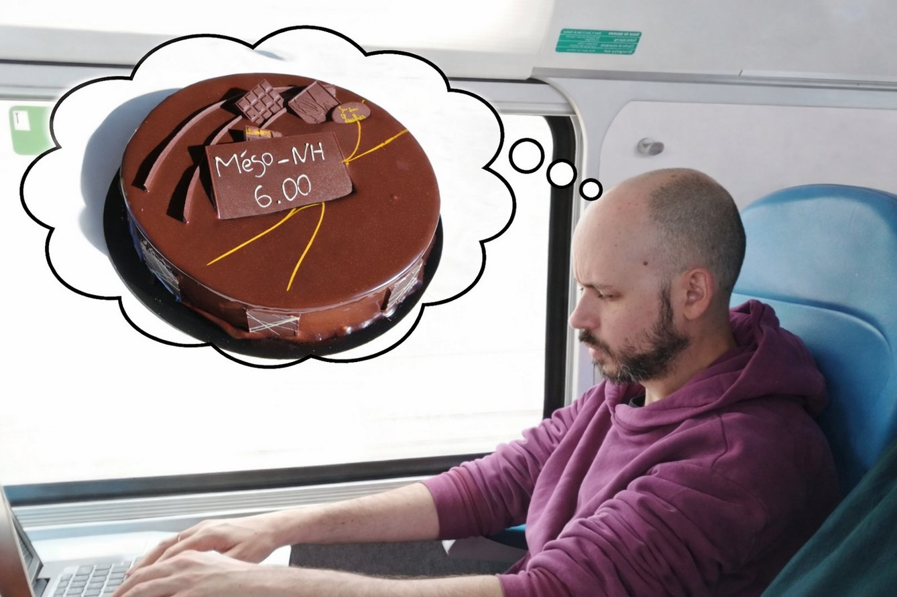

Infolettre #09
================================================

**24 avril 2026.** Version française, English version `here <newsletter_09_english.html>`_.

Chers utilisateurs, chères utilisatrices de Méso-NH,

Voici ci-dessous la 9ème infolettre de notre communauté. Vous y trouverez un entretien avec un membre de l'équipe support de Méso-NH, les dernières nouvelles de l’équipe et la liste des dernières publications et thèses utilisant Méso-NH.

Entretien avec `Quentin Rodier <mailto:quentin.rodier@meteo.fr>`_ (CNRM)
*************************************************************************************************************************************

|pic1|

Quentin, après un énorme travail, tu viens de publier la version 6 de Méso-NH. Peux-tu nous expliquer en quoi est-ce qu'elle est révolutionnaire ?
  La version 6.0.0 de Méso-NH est la première version officielle qui intègre le portage du code sur GPU. Depuis plus de 10 ans, le portage sur GPU de Méso-NH est en effet développé par le LAERO sur des branches en parallèle de la branche principale du code pour ne pas impacter les développements classiques. Avec le portage sur GPU de la physique Méso-NH utilisée dans AROME, qui a entraîné une réécriture conséquente de la physique atmosphérique dans le module externalisé PHYEX, la version 6.0.0 a permis de finaliser officiellement le portage GPU de Méso-NH et de consolider le code commun entre la physique Méso-NH et AROME. De nombreux nouveaux développements ont été intégrés, fruits de plusieurs années de recherche et développement de notre communauté. Je vous renvoie vers `la note de version <https://mesonh.readthedocs.io/en/latest/getting_started/releases/release_note_600.html>`_ qui est très riche et je vous encourage à en consulter les parties qui vous intéressent (il y en a forcément au moins une !).

Quels sont les autres changements qui vont améliorer notre quotidien d'utilisateur.ices ?
  Cela dépend des usages particuliers. Pour les utilisateur.ices GPU de Méso-NH, notamment au LAERO, il n’est plus nécessaire d’utiliser une branche en parallèle de la branche master mais directement la version officielle qui contient tous les autres développements disponibles à tous les utilisateurs de Méso-NH. Pour les utilisateur.ices du schéma de rayonnement ecRaD, il n’y a plus besoin de positionner une variable d’environnement spécifique avant de compiler le code (qui était un oubli fréquent et source de frustration). ecRaD est à présent compilé par défaut. Enfin, on peut citer aussi l’activation par défaut de la compression netCDF avec la librairie Zstandard qui permet non seulement de gagner un facteur 2 à 3 sur la taille des fichiers de sortie mais aussi de gagner légèrement en temps de calcul. Le format LFI n’est plus supporté en écriture.

Et pour les développeur.euses, qu'est-ce que cela change ?
  Beaucoup de choses. Sur les parties de code portées sur GPU (advection, solveur de pression, turbulence, microphysique ICE3), les nombreuses directives OpenACC ont été introduites. Chaque modification de code dans ces parties doivent respecter au mieux ces directives afin de ne pas casser les optimisations réalisées. Sur les parties de codes liées aux aérosols et à la chimie, la librairie ACLIB introduit de nouveaux objets et standards de codage afin que le code spécifique à Méso-NH puisse être utilisé dans d’autres modèles et vice-versa. Une restructuration importante du dépôt a également été effectuée : par exemple le dossier  src/LIB/SURCOUCHE a été déplacé dans MNH/io and MNH/parallel ; de nouveaux sous-dossiers dans src/MNH ont fait leur apparition pour mieux ranger les sources nombreuses. Il faut s’y retrouver mais je trouve personnellement que le code et le dépôt sont beaucoup mieux rangés.

Pourquoi recommandes-tu à toutes et tous de passer dès que possible à cette version 6 ?
  Parce que nous avons mis tout notre cœur dedans ! La remarque suivante s’applique à chaque version majeure : si vous êtes en fin de thèse ou en train de finaliser des simulations pour un article scientifique, je ne vous conseille pas de changer de version. Pour tous les autres, foncez ! La version 6 apporte beaucoup de nouvelles fonctionnalités scientifiques également (voir `la note de version <https://mesonh.readthedocs.io/en/latest/getting_started/releases/release_note_600.html>`_). Si vous développez dans Méso-NH, il est indispensable de migrer vers cette nouvelle version au plus vite parce que le code a beaucoup évolué depuis la version 5.7.2. Une fusion tardive de vos développements avec les nouvelles versions (*merge*) sera pénible.

Quelles perspectives à court et moyen termes à présent ?
  La réponse à cette question est moins personnelle et regroupe des réponses d’une partie de l’équipe support. Les perspectives à court et moyen termes sont de poursuivre les tests en simple précision sur l’ensemble des cas tests tout en travaillant sur l'optimisation de certaines parties du code. La mise en place de l'intégration et réalisation de tests en continu (CI/CD) sur le dépôt gitlab permettra d’accélérer les intégrations de développement et de détecter les bugs au plus proche des modifications qui en sont la cause.
  Sur le portage GPU, un travail sur la convection peu profonde et la microphysique LIMA sera réalisée ainsi que la possibilité d’utiliser l’imbrication de domaines (*grid-nesting*). Une réflexion est également en cours sur la stratégie à adopter face au désengagement du support d'OpenACC du constructeur AMD. Toujours à propos de coût de calcul, l'utilisation d'une grille verticale fine impacte très souvent la stabilité numérique du code et impose un pas de temps petit. Pour pallier ce problème, un travail est en cours pour rendre implicite le couplage entre la surface et l'atmosphère. Côté entrées-sorties (I/O), à court terme il est prévu d’implémenter la possibilité d’avoir plusieurs séries temporelles de variables écrites dans les fichiers de sorties fréquentes « OUT » (via NAM_OUTPUT). A moyen terme, il s’agirait de disposer d’une écriture de fichiers en parallèle par plusieurs tâches au lieu d’une seule actuellement. A court terme, nous continuerons également de faire évoluer le contenu des nouveaux sites web en fonction de vos retours. Toutes ces perspectives seront discutées au sein du futur Conseil Scientifique / Comité de Développement de Méso-NH.

.. note::

  Si vous aussi vous souhaitez expliquer un développement que vous avez mis en place dans Méso-NH, ou une méthode d’analyse que vous partagez à la communauté, n’hésitez pas à me le signaler par `mail <mailto:thibaut.dauhut@utoulouse.fr>`_.

    
    
Les nouvelles de l’équipe support
************************************

Version 6
  Les efforts de l'équipe se sont concentrés sur la parution de cette nouvelle `version 6 <https://mesonh.readthedocs.io/en/latest/getting_started/releases/release_note_600.html>`_ et des nouveaux sites web : `site vitrine <www.mesonh.cnrs.fr>`_ et `site technique <https://mesonh.readthedocs.io>`_ .

Lancement du Forum des Utilisateur.ices de Méso-NH
  Le premier forum des utilisateur.ices de Méso-NH aura lieu le **matin du mercredi 3 juin en salle Coriolis** de l'OMP (14 avenue Edouard Belin, Toulouse). Un pot sera organisé sur place à cette occasion ! Si vous comptez venir sur site, pouvez-vous s'il-vous-plaît m'envoyer `un email <mailto:thibaut.dauhut@utoulouse.fr>`_ pour que j'estime au plus proche le nombre de participant.es ? Merci !

Stage Méso-NH
  Le stage Méso-NH du 10 au 13 mars 2026, en hybride et en anglais, s'est très bien passé. Pour cette session nous avions 23 participants (15 dans la salle et 8 ligne) : stagiaires, doctorant.es, postdocs et CDD (LAERO, CNRM GMME, CERFACS, LMD, Université de Reims, Universités d'Evora et de Lisbonne au Portugal, Institut Néel du CNRS à Grenoble) mais aussi chercheur.euses et ingénieur.es (Université de Varsovie en Pologne,  Université de Reims, CNAM - Laboratoire Géomatique et Foncier du Mans, Institut de recherche RISE de l'Université de Uppsala en Suède).

Autres nouvelles
  - Le pôle technique du Service Méso-NH est animé à présent par Philippe Wautelet et Quentin Rodier.
  - Une politique de durée de vie des branches et des versions de MésoNH va être expérimentée pour assurer une certaine stabilité aux utilisateur.ices qui ont besoin de conserver une même version de MésoNH pendant plusieurs années tout en ayant accès à des améliorations. La numérotation sera la même qu'actuellement en X-Y-Z avec X le numéro de version majeure, Y de version mineure et Z de bugfix. Chaque nouvelle version mineure sera maintenue pendant au moins 2 ans à partir de la sortie de la suivante  (ex : une version 5.7.3 est en cours de préparation). Les correctifs (*bugfix*) avec des numéros de Z croissants ne contiendront que des corrections et devraient garantir d'obtenir les mêmes résultats pour une version mineure donnée (dans le même environnement de travail) aux corrections de bugs près. Les nouvelles fonctionnalités ne pourront être intégrées que dans de nouvelles versions mineures, qui devraient être un peu plus fréquentes qu'actuellement.
  - Une réflexion sur la gestion des branches du code est en cours au sein du pôle technique dans le but de la rendre plus rigoureuse, organisée et compréhensible.

.. note::
  Si vous avez des besoins, idées, améliorations à apporter, bugs à corriger ou suggestions concernant les entrées/sorties, `Philippe Wautelet <mailto:philippe.wautelet@cnrs.fr>`_ est toujours preneur.

Dernières publications utilisant Méso-NH
****************************************************************************************

Convection and organisation
  - Effect of vertical wind shear on convective clouds: development, organization, and turbulence [`Bidou et al. <https://doi.org/10.5194/egusphere-2026-323>`_, *in discuss.*]
  - Sensitivity of flower trade-wind cloud organisation to mesoscale atmospheric heterogeneities [`Dauhut et al. <https://doi.org/10.1002/qj.70141>`_, 2026]

Cyclones and waterspouts
  - On the tropical nature of an intense Mediterranean cyclone in the ocean-atmosphere system [`Brumer et al. <https://hal.science/hal-05444958v1>`_, *submitted*]
  - Can hot water discharged from industrial processes enhance the likelihood of waterspouts? [`Capecchi et al. <https://doi.org/10.48550/arXiv.2603.24233>`_, 2026]
  - Orographic impacts of Réunion Island and Madagascar on heavy rainfall during Tropical Cyclone Batsirai (2022) [`Lee et al. <https://doi.org/10.5194/egusphere-2026-1893>`_, *in discuss.*]

Fire meteorology
  - Wildfires in the Southern Amazon: Insights into Pyro-Convective Cloud Development from Two Case Studies in August 2021 [`Bezerra et al. <https://doi.org/10.3390/atmos17020173>`_, 2026]
  - Numerical Investigation of Surface–Atmosphere Interaction and Fire Danger in Northern Portugal: Insights into the Wildfires on July 29, 2025 [`Couto et al. <https://doi.org/10.3390/fire9030111>`_, 2026]

Model development and parametrisations
  - Meso-NH-ISO v1.0: a water stable isotopes scheme in the non-hydrostatic mesoscale atmospheric model Meso-NH. Application to a 2D West African squall line [`Barthe et al. <https://doi.org/10.5194/egusphere-2026-548>`_, *in discuss.*]
  - Atmosphere, ocean, and coupled ocean–atmosphere models in a single code [`Redelsperger <https://doi.org/10.1002/qj.70133>`_, 2026]
  - An update of shallow cloud parameterization in the AROME NWP model [`Marcel et al. <https://doi.org/10.5194/acp-26-3901-2026>`_, 2026]

Surface-atmosphere interactions
  - PANAME-Urban campaign: investigating multiscale surface-atmosphere interactions and thermal-contrasts in the Paris region (France) [Lemonsu et al., *in press* 2026]
  - Impact of surface interactivity on the initiation of deep convection in the Sahel: A cloud-resolving model study [`Tomasini and Couvreux <https://doi.org/10.1016/j.atmosres.2026.108941>`_, 2026]

PhD thesis
  - Microphysique et propriétés optiques des nuages de glace dans le visible et l’infrarouge appliquées au transfert radiatif pour l’observation satellitaire opérationnelle [`Joseph <https://theses.fr/s361932>`_, Université de Toulouse, 2026]

.. note::

   Si vous souhaitez partager avec la communauté le fait qu’un de vos projets utilisant Méso-NH a été financé ou toute autre communication sur vos travaux (notamment posters et présentations *disponibles en ligne*), n’hésitez pas à `m’écrire <mailto:thibaut.dauhut@utoulouse.fr>`_. Je suis également toujours preneur de vos avis sur les infolettres.

Bonnes simulations avec Méso-NH !

A bientôt,

Thibaut Dauhut et toute l’équipe Méso-NH : Philippe Wautelet, Quentin Rodier, Didier Ricard, Joris Pianezze, Juan Escobar et Jean-Pierre Chaboureau
